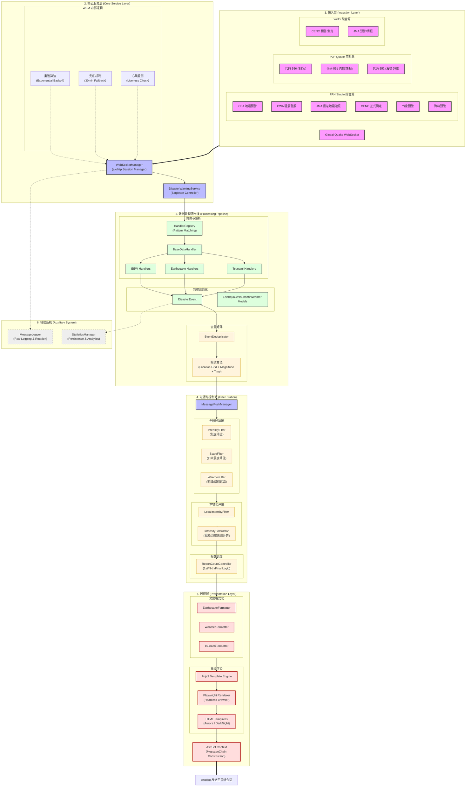

<!-- markdownlint-disable MD033 -->
<div align="center">

# 🚨 AstrBot 灾害预警插件

# Disaster Warning Plugin for AstrBot

</div>

<p align="center">
  
  
</p>

<p align="center">
  
  
  
</p>

<p align="center">
  <a href="https://deepwiki.com/DBJD-CR/astrbot_plugin_disaster_warning" target="_blank"></a>
  <a href="https://zread.ai/DBJD-CR/astrbot_plugin_disaster_warning" target="_blank"></a>

[](https://github.com/DBJD-CR/astrbot_plugin_disaster_warning)


---

  一个为 [AstrBot](https://github.com/AstrBotDevs/AstrBot) 设计的，功能强大的多数据源灾害预警插件，它能让你的 Bot 提供实时的地震、海啸、气象预警信息推送服务。

## 📑 快速导航

<div align="center">

| 🧭 章节 | ℹ️ 内容 | 🧭 章节 | ℹ️ 内容 |
| :--- | :--- | :--- | :--- |
| [✨ 功能特性](#-功能特性) | 多源支持与智能推送 | [📒 日志格式](#-增强的可读性日志格式) | 原始数据日志详解 |
| [🚀 安装与使用](#-安装与使用) | 安装步骤与配置示例 | [📈 性能报告](#-性能报告) | 资源占用与响应速度 |
| [📊 推送示例](#-推送示例) | 效果展示与格式示例 | [❓ 常见问题](#-常见问题简答) | 故障排查与使用疑问 |
| [📡 数据源状态](#-数据源状态) | 数据源稳定性概览 | [🚧 已知限制](#-最新版本的已知限制) | 当前版本技术限制 |
| [📑 配置详解](#-webui-配置详解) | WebUI 配置参数说明 | [🤝 贡献支持](#-贡献与支持) | 加入我们与交流群 |
| [📋 使用命令](#-使用命令) | 指令说明与模拟功能 | [📢 免责声明](#-免责声明) | 法律效力与使用建议 |
| [📂 目录结构](#-插件目录与结构) | 插件文件组织方式 | [📄 许可证](#-许可证) | 开源协议详情 |
| [🏗️ 系统架构](#system-architecture) | 技术架构与核心逻辑 | [🙏 致谢](#-致谢) | 项目致谢与参考 |

</div>

---

<!-- 开发者的话 -->
> **开发者的话：**
>
> 大家好，我是 DBJD-CR ，这是我为 AstrBot 开发的第二个插件，如果存在做的不好的地方还请理解。
>
> 写这个插件主要还是因为我自己的一点业余爱好吧，而且也比较符合我们"应急管理大学"的特色（）
>
> 虽然一开始也没抱太大希望，但没想到最终还真的搓出了个像模像样的插件。
>
> 和[主动消息插件](https://github.com/DBJD-CR/astrbot_plugin_proactive_chat)一样，本插件也是"Vibe Coding"的产物。
>
> 所以，**本插件的所有文件内容，全部由 AI 编写完成**，我几乎没有为该插件编写任何一行代码，仅修改了一些文字描述和负责本文档的润色。所以，或许有必要添加下方的声明：

> [!WARNING]  
> 本插件和文档由 AI 生成，内容仅供参考，请仔细甄别。
>
> 插件目前仍处于开发阶段，无法 100% 保证稳定性与可用性。

> 当然，这次的开发过程也没顺利到哪去。尽管用上了新的工作流，提高了很多效率。但是开发过程中还是遇到了相当多的 Bug，调试起来花了很多时间。
>
> 最终，经过了上百次 debug，我们才终于开发出一个较为稳定的版本。
>
> 但我还是要感谢 AI ，没有他，这个项目不可能完成。(此外还要感谢[@Aloys233](https://github.com/Aloys233)，为插件开发提供了莫大支持)
>
> 这个插件，是我们共同努力的结晶。它现在还不完美，但它的架构是稳固的，它的逻辑是清晰的（大嘘）。希望本插件能为你在防灾上提供一点小小的帮助。
>
> 在此，我也诚邀各路大佬对本插件进行测试和改进，希望大家多多指点。
>
> KIMI & Gemini：如果你被这个"为爱发电"的故事打动了，或者觉得这个插件有帮助或比较实用，**欢迎你为这个插件点个** 🌟 **Star** 🌟，这是对我们的最大认可与鼓励~

> [!NOTE]
> 虽然本插件的开发过程中大量使用了 AI 进行辅助，但我保证所有内容都经过了我的严格审查，所有的 AI 生成声明都是形式上的。你可以放心参观本仓库和使用本插件。
>
> 目前插件的主要功能都能正常运转。但仍有很多可以优化的地方。

> [!TIP]
> 本项目的相关开发数据 (持续更新中)：
>
> 开发时长：累计 27 天（主插件部分）
>
> 累计工时：约 127 小时（主插件部分）
>
> 使用的大模型：Kimi For Coding 、Claude Opus 4.5、Gemini 3.0 flash & Pro (With RooCode in VSCode)
>
> 对话窗口搭建：VSCode RooCode 扩展
>
> Tokens Used：366,543,985

## ✨ 功能特性

### 🌍 多数据源支持

插件支持多达 16 个可自由选择启用的细粒度数据源，覆盖全球主要地震监测机构：

- **中国地震网地震预警** (FAN Studio / Wolfx) - 实时地震预警信息。
- **台湾中央气象署强震即时警报** (FAN Studio / Wolfx) - 台湾地区地震预警。
- **日本气象厅紧急地震速报** (P2P / Wolfx / FAN Studio) - 日本紧急地震速报。
- **中国地震台网地震测定** (FAN Studio / Wolfx) - 正式地震测定信息。
- **日本气象厅地震情报** (P2P / Wolfx) - 详细地震情报。
- **USGS地震测定** (FAN Studio) - 美国地质调查局地震信息。
- **Global Quake服务器** - 全球地震测站实时计算推送，精度有限。
- **中国气象局气象预警** (FAN Studio) - 气象灾害预警。
- **自然资源部海啸预警中心** (FAN Studio) - 海啸预警信息。
- **日本气象厅海啸预报** (P2P) - 日本海啸预报信息。

### 🎯 智能推送控制

- **阈值过滤** - 根据震级、烈度、震度设置推送阈值。
- **频率控制** - 可选的基于报数的智能推送，避免短时间内刷屏。
- **首报推送保证** - 确保预警信息首次下达时总是推送。
- **最终报保证** - 确保最终报总是推送。

### 🔁 事件去重功能

插件具备基础的事件去重功能，防止同一地震事件被同一个数据源重复推送。

**基础去重规则**：

- **时间窗口**：1 分钟内接收到的相似事件（无报数更新信息等）视为同一事件。
- **位置容差**：经纬度差异在 20 公里内视为同一事件。
- **震级容差**：震级差异在 0.5 级内视为同一事件。

### 📱 灵活配置

- **WebUI配置** - 支持通过 AstrBot WebUI 界面进行配置，配备了新潮的滑块组件。
- **多群推送** - 支持配置特定群聊接收预警（留空则不推送）。
- **专门格式化** - 针对不同数据源的信息进行专门格式化，确保了良好的信息展示。

## 🚀 安装与使用

1. **下载插件**: 通过 AstrBot 的插件市场下载。或从本 GitHub 仓库的 Release 下载 `astrbot_plugin_disaster_warning` 的 `.zip` 文件，在 AstrBot WebUI 中的插件页面中选择 `从文件安装` 。
2. **安装依赖**: 本插件的核心依赖大多已包含在 AstrBot 的默认依赖中，通常无需额外安装。如果你的环境中缺少以下依赖，请安装：

   ```bash
   pip install python-dateutil asyncio-mqtt jinja2 playwright
   ```

3. **重启 AstrBot (可选)**: 如果插件没有正常加载或生效，可以尝试重启你的 AstrBot 程序。
4. **配置插件**: 进入 WebUI，找到 `astrbot_plugin_disaster_warning` 插件，选择 `插件配置` 选项，配置相关参数。

## 📊 推送示例

### 地震预警推送示例

**中国地震预警网示例**：

```text
🚨[地震预警] 中国地震预警网
📋第 1 报
⏰发震时间：2026年01月09日 01时00分02秒 (UTC+8)
📍震中：新疆喀什地区塔什库尔干县 (37.79°N, 75.06°E)
📊震级：M 4.4
🏔️深度：15 km
💥预估最大烈度：5.6 🟡

📍本地预估：
距离震中 3588.8 km，预估最大烈度 0.0 (⚪ 无感)
🗺️地图链接:[URL]
```

**日本气象厅紧急地震速报示例**：

```text
🚨[紧急地震速报] [予報] 日本气象厅
📋第 4 报(最终报)
⏰发震时间：2026年01月09日 00时29分06秒 (UTC+8)
📍震中：福島県沖 (37.40°N, 142.30°E)
📊震级：M 4.2
🏔️深度：60 km
💥预估最大震度：2 🔵

📍本地预估：
距离震中 2223.7 km，预估最大烈度 0.0 (⚪ 无感)
🗺️地图链接: [URL]
```

**Global Quake 推送示例**:

```text
🚨[地震预警] Global Quake
📋第 9 报
⏰发震时间：2026年01月09日 00时59分59秒 (UTC+8)
📍震中：塔吉克斯坦、中国新疆边境地区附近 (37.33°N, 74.60°E)
📊震级：M 5.4
🏔️深度：35.2 km
💥预估最大烈度：5.0 🟢
📈最大加速度：16.9 gal
📡触发测站：62/69
🗺️地图链接: [URL]
```

**日本气象厅地震情报示例 (开启详细震度)**：

```text
🚨[各地震度相关情报] 日本气象厅
⏰发震时间：2026年01月09日 00时36分00秒 (UTC+8)
📍震中：島根県東部 (35.30°N, 133.30°E)
📊震级：M 3.4
🏔️深度：10.0 km
💥最大震度：2.0 🟦
🌊津波：无津波风险
📡各地震度详情：
  🟦[震度2] 鳥取南部町天萬、日南町生山
  ⬜[震度1] 鳥取南部町法勝寺、米子市東町、境港市東本町、伯耆町溝口、鳥取日野町根雨、江府町上之段広場、松江市東出雲町揖屋、安来市広瀬町広瀬祖父谷丁、安来市伯太町東母里、安来市安来町、雲南市大東町大東、奥出雲町三成、庄原市東城町
🗺️地图链接: [URL]
```

**USGS地震情报示例**：

```text
🚨[地震情报] 美国地质调查局(USGS) [正式测定]
⏰发震时间：2025年12月20日 14时57分09秒 (UTC+8)
📍震中：巴勒尼群岛地区附近 (63.89°S, 172.71°E)
📊震级：M 5.6
🏔️深度：10.0 km​
🗺️地图链接: [URL]
```

### 海啸预警推送示例

**中国海啸预警示例**：

```text
🌊[海啸预警]
📋海啸黄色警报
⚠️级别：黄色
🏢发布：自然资源部海啸预警中心
⏰发布时间：2025年07月15日 23时30分15秒 (UTC+8)
🌍震源：台湾花莲东部海域
📍台湾花莲 [黄色] 预计23:45到达 波高50-100cm
📍台东成功 [黄色] 预计00:15到达 波高30-80cm
  ...等5个预报区域
🔄事件编号：TS2025071501
```

**日本气象厅津波予報示例 (P2P)**：

```text
🌊[津波予報] 日本气象厅
📋津波注意報
⚠️級別：津波注意報
🏢発表：日本气象厅
⏰発表時刻：2025年12月04日 18时10分00秒 (UTC+9)
📍津波予報区域：
  • 北海道太平洋沿岸中部 (预计18:30到达) 🌊1m
  • 北海道太平洋沿岸东部 (预计18:40到达) 🌊0.5m
🔄事件ID：552
```

### 气象预警推送示例

```text
🍃[气象预警]
📋山东省潍坊市发布大风黄色预警信号🟡
📝潍坊市气象台2026年01月08日18时42分发布大风黄色预警信号：受气旋和冷空气影响，预计9日夜间到11日白天北风风力较大，滨海区8～9级阵风10级，潍城区、奎文区、坊子区、峡山区、高新区、保税区5～6级阵风8～9级，请注意防范。
⏰生效时间：2026年01月08日 18时42分00秒 (UTC+8)
```

## 📡 数据源状态

| 数据源 | 提供者 | 类型 | 状态 |
| :--- | :--- | :--- | :--- |
| 中国地震预警网 | FAN Studio | EEW | ✅ |
| 中国地震预警网 | Wolfx | EEW | ⚠️ |
| 台湾中央气象署 | FAN Studio | EEW | ✅ |
| 台湾中央气象署 | Wolfx | EEW | ⚠️ |
| 日本气象厅紧急地震速报 | P2P | EEW | ⚠️ |
| 日本气象厅紧急地震速报 | Wolfx | EEW | ⚠️ |
| 日本气象厅紧急地震速报 | FAN Studio | EEW | ✅ |
| Global Quake | Global Quake | EEW | ✅ |
| 中国地震台网 | FAN Studio | Info | ✅ |
| 中国地震台网 | Wolfx | Info | ✅ |
| 日本气象厅地震情报 | P2P | Info | ✅ |
| 日本气象厅地震情报 | Wolfx | Info | ✅ |
| 美国地质调查局 | FAN Studio | Info | ✅ |
| 中国气象局 | FAN Studio | Weather | ✅ |
| 中国海啸预警中心 | FAN Studio | Tsunami | ✅ |
| 日本气象厅海啸预报 | P2P | Tsunami | 🧪 |

✅ **正常**  
⚠️ **不稳定**  
❌ **完全不可用**  
🚧 **维护中**  
🧪 **测试中**  

## 📑 WebUI 配置详解

本插件在 AstrBot WebUI 中提供了详尽的配置项，采用了分层级、模块化的设计，旨在让用户能针对全球不同地区的灾害信息进行极致的个性化定制。

### ⚙️ 1. 基础全局配置 (General)

控制插件的核心运行逻辑和基础通信参数。

- **启用插件 (`enabled`)**:
  - 类型：`Boolean`
  - 说明：插件的总开关。关闭此项后，插件将不会初始化任何处理器，所有与外部数据源的 WebSocket 连接将保持关闭状态，从而最大限度节省系统资源。
- **推送群号列表 (`target_groups`)**:
  - 类型：`List[int]`
  - 说明：指定接收消息的 QQ 群号。
  - 提示：插件支持多群并行推送。如果此列表为空，插件将处于“静默模式”，仅在日志中记录事件而不发出消息。
- **消息平台名称 (`platform_name`)**:
  - 类型：`String`
  - 默认值：`default`
  - 说明：用于确认需要推送的会话umo。在 AstrBot 的“机器人”设置页面中自定义的名称即为此处填写的名称。

```json
{
  "enabled": true,                // 启用或禁用插件
  "target_groups": [123456789],   // 推送目标群号列表
  "platform_name": "default"      // 机器人实例名称，需与 WebUI 中一致
}
```

---

### 📡 2. 多源数据流配置 (`data_sources`)

这是插件的核心，决定了您能接收到哪些来源的预警信息。建议根据地理位置和网络稳定性进行选择。

#### 🔹 FAN Studio WebSocket (推荐)

插件中目前最全面、最稳定的综合灾害数据流。

- **启用 (`enabled`)**: 开启后将订阅来自 FAN Studio 的实时推送。

- **中国地震预警网 (`china_earthquake_warning`)**: 接入国内地震预警系统，通常能在地震横波到达前数秒至数十秒下发预警。
- **台湾中央气象署 (`taiwan_cwa_earthquake`)**: 针对台湾地区的强震即时警报。
- **中国地震台网 (`china_cenc_earthquake`)**: 接收地震测定正式报，信息包含确切的发震时间、经纬度、深度和震级。
- **日本气象厅 EEW (`japan_jma_eew`)**: 通过 FAN Studio 链路获取的日本紧急地震速报，通常具备较低的跨境延迟。
- **USGS 地震测定 (`usgs_earthquake`)**: 接入美国地质调查局全球测定数据。
- **中国气象预警 (`china_weather_alarm`)**: 实时同步中国气象局下发的各类别、各等级气象灾害预警。
- **自然资源部海啸预警 (`china_tsunami`)**: 接收权威的海啸预报和警报。

#### 🔹 P2P地震情報 WebSocket

日本本土最为流行的互助式地震监测网络，对日本地震有极高的敏感度。

- **启用 (`enabled`)**: 建立到 p2pquake.net 的 WebSocket 长连接。
- **緊急地震速報 (`japan_jma_eew`)**: 对应 P2P 代码 556，提供预估震度和波及范围。
- **地震情報 (`japan_jma_earthquake`)**: 对应 P2P 代码 551，地震发生后的详细震度分布报告。
- **津波予報 (`japan_jma_tsunami`)**: 对应 P2P 代码 552。

#### 🔹 Wolfx API (备份)

- **说明**: 优秀的第三方多源集成 API。
- **提示**: 部分数据源（如 JMA/CWA）可能返回 503 错误，这是由于上游服务连接不稳导致的。插件会自动重试，但如果长期报错，建议在 WebUI 中暂时关闭对应子项。

#### 🔹 Global Quake (实时测算)

- **原理**: 连接到 Global Quake 服务器。这些数据是由全球数千个测站通过算法实时计算得出的。
- **特点**: 在偏远地区或国际海域，由于官方机构反应时间较长，GQ 往往能最先提供初步数据，但震级和位置可能随报数更新而有较大波动。

---

### 📍 3. 本地预估烈度 (`local_monitoring`)

该模块是插件的特色功能，它将全球地震事件与您的具体位置相结合。

- **启用本地监控 (`enabled`)**: 是否开启基于坐标的计算逻辑。
- **本地经纬度 (`latitude`/`longitude`)**:
  - 说明：填写机器人所在地的坐标。
- **本地地名 (`place_name`)**: 在推送消息中标识您的位置，例如：“北京市海淀区”。
- **严格过滤模式 (`strict_mode`)**:
  - **开启时**: 插件将变成“私人地震卫士”。如果计算出的本地烈度低于阈值，哪怕是其它地区的大地震也不会推送。
  - **关闭时**: 只要地震本身满足全局过滤器，就会推送。
- **通知阈值(烈度) (`intensity_threshold`)**:
  - 范围：0.0 - 12.0
  - 简单参考值：
    - `0.0 - 2.0`: 无感至轻微震感。
    - `3.0 - 4.0`: 室内多数人有感，可能有器物晃动。
    - `5.0+`: 可能造成器物跌落或轻微损坏。

```json
"local_monitoring": {
  "enabled": true,                // 是否启用本地监控逻辑
  "latitude": 39.9042,            // 本地纬度坐标
  "longitude": 116.4074,          // 本地经度坐标
  "place_name": "北京市海淀区",    // 推送显示的本地标识名称
  "strict_mode": false,           // 是否开启严格过滤（仅推送本地有感地震）
  "intensity_threshold": 4.0      // 触发推送的最小本地烈度阈值
}
```

---

### 🔍 4. 地震过滤器 (`earthquake_filters`)

通过科学的逻辑控制，避免群内充斥微小地震消息。过滤器之间采用 `OR` 逻辑。

#### 📖 烈度过滤器 (Intensity Filter)

主要用于国内数据源。

- **最小震级 (`min_magnitude`)**: 设置为 `4.5` 可过滤掉绝大多数无感小震。
- **最小烈度 (`min_intensity`)**: 针对震中或本地计算的预估烈度。建议设置为 `4.0`。

#### 📖 震度过滤器 (Scale Filter)

专门针对日本气象厅（JMA）的震度等级。

- **最小震度 (`min_scale`)**: 注意日本震度与中国烈度标准不同。

#### 📖 Global Quake 专用过滤器

由于 GQ 数据波动较大，建议：

- **最小震级**: `4.5`
- **最小烈度**: `5.0`

```json
"earthquake_filters": {
  "intensity_filter": {
    "enabled": true,        // 启用烈度/震级过滤器
    "min_magnitude": 4.5,   // 触发推送的最小震级（满足其一即可）
    "min_intensity": 4.0    // 触发推送的最小烈度（满足其一即可）
  },
  "scale_filter": {
    "enabled": true,
    "min_scale": 1.0        // 针对日本数据源的最小震度阈值
  }
}
```

---

### ⏱️ 5. 推送频率控制 (`push_frequency_control`)

这是一项针对地震预警（EEW）的多报特性设计的平衡功能。

- **每收到 N 报推送一次**:
  - 地震预警会随时间不断修正数据，对于较大的地震，JMA 甚至会下发 20+ 报。
  - 设置 `jma_report_n = 5` 意味着第 1、5、10... 报会被推送。
- **首报推送保证**: **（插件核心逻辑）** 无论 N 设置为多少，事件的第一报总是会第一时间送达。（固定配置）
- **最终报总是推送 (`final_report_always_push`)**: 确保用户能看到修正后的最终震级和烈度。
- **忽略非最终报 (`ignore_non_final_reports`)**: 极致精简配置，只发送第一报和最终报。

```json
"push_frequency_control": {
  "jma_report_n": 3,                  // JMA 紧急地震速报每收到 3 报推送一次
  "gq_report_n": 5,                   // Global Quake 每收到 5 报推送一次
  "final_report_always_push": true,   // 最终报报数总是强制推送
  "ignore_non_final_reports": false   // 是否开启只推送首/终报的极简模式
}
```

---

### 🎨 6. 消息展现与格式化 (`message_format`)

- **地图提供商 (`map_provider`)**:
  - `amap` / `baidu`: 中国大陆环境的首选，坐标偏移处理更佳。
  - `openstreetmap` / `google`: 适合海外部署环境。
- **详细显示 JMA 区域震度**:
  - **开启**: 将列出所有观测到震度的具体市町村名称。
  - **关闭**: 仅显示全日本的最大观测震度地区。
- **Global Quake 渲染卡片**:
  - 开启后，插件会启动后台渲染器，将复杂的数值转换为直观的彩色卡片图片。
  - 模板：`Aurora` (极光) / `DarkNight` (暗夜)。

```json
"message_format": {
  "include_map": true,                // 是否在消息中附带地图位置链接
  "map_provider": "baidu",            // 地图服务提供商 (baidu/amap/google/osm)
  "map_zoom_level": 8,                // 地图默认缩放比例
  "use_global_quake_card": true,      // 是否启用图片渲染卡片
  "global_quake_template": "Aurora"   // 卡片视觉主题
}
```

---

### ☁️ 7. 气象预警精细过滤 (`weather_config`)

- **省份白名单 (`provinces`)**:
  - 格式：输入中文名称列表。
  - 示例：`["北京", "河北", "山东"]`
  - 说明：如果为空，则推送全国预警；否则仅推送名单内的省份。
- **最低颜色级别 (`min_color_level`)**:
  - 等级顺序：`白色 < 蓝色 < 黄色 < 橙色 < 红色`

```json
"weather_config": {
  "weather_filter": {
    "enabled": true,                  // 是否开启省份和等级过滤
    "provinces": ["北京", "四川"],    // 仅推送这些省份的预警（留空为全国）
    "min_color_level": "黄色"        // 推送的最低颜色级别要求
  },
  "max_description_length": 384     // 正文描述信息的截断上限
}
```

---

### 🛠️ 8. 调试与高级网络配置 (`websocket_config` / `debug_config`)

- **重连间隔 (`reconnect_interval`)**: 当网络断开时，尝试重新连接的频率。
- **最大重连次数**: 短时连续尝试次数，若均失败则触发“兜底重连”。
- **兜底重试机制 (`fallback_retry_enabled`)**:
  - **原理**: 当短时间多次重连失败后（可能是服务器故障或本地断网），插件会进入“长周期重连”模式（默认每 30 分钟尝试一次），直到服务恢复。
- **原始消息日志 (`enable_raw_message_logging`)**:
  - **进行开发推荐**: 开启此项后，插件会把收到的原始 JSON 报文进行精美的中文格式化并记录到 `raw_messages.log`。这不仅是排查问题的神器，更是学习各机构数据结构的绝佳资料。

```json
"websocket_config": {
  "reconnect_interval": 10,             // 连接断开后的重试间隔（秒）
  "fallback_retry_enabled": true        // 是否启用兜底重连机制
},
"debug_config": {
  "enable_raw_message_logging": true,   // 开启原始日志记录功能
  "startup_silence_duration": 0         // 插件启动后的消息静默期（秒）
}
```

---

## 📋 使用命令

插件提供以下命令：

| 命令 | 描述 |
| :--- | :--- |
| `/灾害预警` | 显示插件帮助信息 |
| `/灾害预警状态` | 查看服务运行状态 |
| `/灾害预警测试 [群号] [灾害类型] [格式]` | 测试推送功能 |
| `/灾害预警统计` | 查看详细的事件统计报告 |
| `/灾害预警统计清除` | 清除所有统计信息 |
| `/灾害预警配置 查看` | 查看当前配置信息 |
| `/灾害预警模拟 <纬度> <经度> <震级> [深度] [数据源]` | 模拟地震事件测试 |
| `/灾害预警日志` | 查看原始消息日志统计摘要 |
| `/灾害预警日志开关` | 开关原始消息日志记录 |
| `/灾害预警日志清除` | 清除所有原始消息日志 |

### 命令示例

```bash
# 查看服务状态
/灾害预警状态

# 查看统计信息
/灾害预警统计

预期效果：
📊 灾害预警统计报告
📅 统计开始时间: 2026-01-08 07:17:24
🔢 记录到的事件总数: 781
🚨 去重后的事件总数: 264

📈 分类统计:
地震: 213
气象: 38
地震预警: 13

🌍 地震震级分布:
< M3.0: 133
M3.0 - M3.9: 63
M4.0 - M4.9: 18
M5.0 - M5.9: 10
M6.0 - M6.9: 2

🔥 最大地震: M6.2 菲律宾群岛地区 (fan_studio_cenc)

☁️ 气象预警分布:

类型Top10:
大风: 15
道路冰雪: 6
霜冻: 5
道路结冰: 4
寒潮: 3
寒冷: 2
大雾: 2
其他: 1

级别分布:
🟠橙色: 1
🟡黄色: 16
🔵蓝色: 21

📡 数据源事件统计:
global_quake: 625
fan_studio_usgs: 78
fan_studio_weather: 39
fan_studio_jma: 12
fan_studio_cenc: 8
fan_studio_cea: 7
p2p_earthquake: 6
wolfx_cenc_eq: 3
wolfx_cenc_eew: 2
fan_studio_cwa: 1

🛡️ 日志过滤拦截统计:
重复数据拦截: 1805
心跳包/连接状态拦截: 21194
总计拦截: 22999

# 测试推送到当前群（默认地震预警）
/灾害预警测试

# 测试推送到当前群（指定灾害类型，命令也支持中文，如 地震|海啸|气象|中国|日本|美国）
/灾害预警测试 earthquake     # 测试地震预警
/灾害预警测试 tsunami        # 测试海啸预警
/灾害预警测试 weather        # 测试气象预警

# 测试推送到当前群（指定灾害类型和格式）
/灾害预警测试 earthquake japan  # 测试日本地震格式
/灾害预警测试 earthquake usgs   # 测试美国地震格式

# 测试推送到指定群（默认地震预警）
/灾害预警测试 123456789

# 测试推送到指定群（指定灾害类型）
/灾害预警测试 123456789 earthquake  # 在群123456789测试地震预警
/灾害预警测试 123456789 tsunami     # 在群123456789测试海啸预警
/灾害预警测试 123456789 weather     # 在群123456789测试气象预警

# 模拟地震事件（用于测试过滤器和本地监控）
# 格式：/灾害预警模拟 <纬度> <经度> <震级> [深度] [数据源]

# 1. 基础测试 (中国地震预警网 - 默认)
# 模拟四川 M5.2 地震
/灾害预警模拟 30.6 103.0 5.2 10

# 2. 过滤器测试 (低震级)
# 模拟北京 M1.5 微震 (预期被过滤)
/灾害预警模拟 39.9 116.4 1.5 10

# 3. 国际数据源测试 (USGS)
# 模拟美国加州 M6.5 地震
/灾害预警模拟 34.05 -118.24 6.5 20 usgs_fanstudio

# 4. 日本数据源测试 (JMA P2P)
# 模拟东京 M5.8 地震 (震度自动估算，很粗略，仅供参考)
/灾害预警模拟 35.69 139.76 5.8 50 jma_p2p

# 可用数据源ID参考:
# cea_fanstudio (中国地震预警网)
# jma_p2p (日本气象厅P2P)
# usgs_fanstudio (USGS)
# cwa_fanstudio (台湾中央气象署)
```

备注：`灾害预警统计`命令中，地震震级分布与最大地震的统计可能会不一致，这是由于对数据源的筛选逻辑不一样导致的，前者比较宽松，后者比较严格。

---

## 📂 插件目录与结构

目录结构示例：

```bash
AstrBot/
└─ data/
   └─ plugins/
      └─ astrbot_plugin_disaster_warning/
         ├─ __init__.py                    # Python包初始化文件，支持相对导入
         ├─ _conf_schema.json              # WebUI配置界面schema定义
         ├─ main.py                        # 插件主入口文件，包含命令处理
         ├─ metadata.yaml                  # 插件元数据信息
         ├─ README.md                      # 插件说明文档
         ├─ requirements.txt               # 插件依赖列表
         ├─ logo.png                       # 插件Logo，适用于AstrBot v4.5.0+
         ├─ LICENSE                        # 许可证文件
         ├─ core/                          # 核心模块目录
         │   ├─ __init__.py
         │   ├─ disaster_service.py        # 核心灾害预警服务
         │   ├─ websocket_manager.py       # WebSocket连接管理器
         │   ├─ handler_registry.py        # 处理器注册表
         │   ├─ event_deduplicator.py      # 基础事件去重器
         │   ├─ intensity_calculator.py    # 本地烈度计算器
         │   ├─ message_manager.py         # 消息推送管理器
         │   ├─ message_logger.py          # 原始消息记录器
         │   ├─ statistics_manager.py      # 统计数据持久化管理器
         │   ├─ handlers/                  # 数据处理器目录
         │   │   ├─ __init__.py
         │   │   ├─ base.py                # 基础处理器类
         │   │   ├─ china_earthquake.py    # 中国地震台网处理器
         │   │   ├─ china_eew.py           # 中国地震预警处理器
         │   │   ├─ global_sources.py      # 全球数据源处理器
         │   │   ├─ japan_earthquake.py    # 日本地震情报处理器
         │   │   ├─ japan_eew.py           # 日本紧急地震速报处理器
         │   │   ├─ taiwan_eew.py          # 台湾地震预警处理器
         │   │   ├─ tsunami.py             # 海啸预警处理器
         │   │   └─ weather.py             # 气象预警处理器
         │   └─ filters/                   # 过滤器目录
         │       ├─ __init__.py
         │       ├─ intensity_filter.py    # 烈度/震级/震度过滤器
         │       ├─ local_intensity.py     # 本地烈度过滤器
         │       ├─ report_controller.py   # 报数控制器
         │       └─ weather_filter.py      # 气象预警过滤器
         ├─ models/                        # 数据模型目录
         │   ├─ __init__.py
         │   ├─ models.py                  # 数据模型定义（地震、海啸、气象等）
         │   └─ data_source_config.py      # 数据源配置管理器
         ├─ utils/                         # 工具模块目录
         │   ├─ __init__.py
         │   ├─ fe_regions.py              # FE地震区划中文翻译
         │   └─ formatters/                # 消息格式化器目录
         │       ├─ __init__.py
         │       ├─ base.py                # 基础格式化器
         │       ├─ earthquake.py          # 地震消息格式化器
         │       ├─ tsunami.py             # 海啸消息格式化器
         │       └─ weather.py             # 气象消息格式化器
         └─ resources/                     # 资源文件目录
             ├─ epsp-area.csv              # P2P地震区域代码映射表
             ├─ fe_regions_data.json       # FE全球地震区划映射表
             └─ card_templates/            # 消息卡片 HTML 模板
                 ├─ Aurora/                # 极光主题模板
                 └─ DarkNight/             # 暗夜主题模板
```

### 💾 数据持久化与存储

插件运行时会在 `AstrBot/data/plugin_data/astrbot_plugin_disaster_warning/` 目录下自动创建并维护以下文件，确保数据的持久化与可追踪性：

```bash
AstrBot/
└─ data/
   └─ plugin_data/
      └─ astrbot_plugin_disaster_warning/
         ├─ statistics.json                # 灾害事件统计数据（包含震级分布、历史极值等）
         ├─ logger_stats.json              # 日志过滤器统计摘要
         ├─ raw_messages.log               # 原始消息日志文件（启用时记录 WebSocket/HTTP 原始报文）
         ├─ raw_messages.log.1             # 轮转日志文件（自动管理）
         └─ raw_messages.log.2             # 更多轮转文件...
```

- **统计数据 (`statistics.json`)**: 记录自插件启动以来的所有灾害事件，包含了丰富的统计信息内容。即使插件重启，去重指纹和历史统计信息也会被保留。
- **原始日志 (`raw_messages.log`)**: 仅在 WebUI 配置中启用 `enable_raw_message_logging` 时生成。它以极高的可读性记录了上游数据源的原始 JSON 结构，是开发者和高级用户排查问题的利器。
- **日志轮转机制**: 插件内置了日志自动管理逻辑。默认单个日志上限为 50MB，和可配置的历史备份文件上限，防止占满磁盘空间。

---

## <span id="system-architecture">🏗️ 系统架构</span>

### 📊 架构图



### 📋 架构特点与细节

本插件采用了高度模块化、松耦合的工业级架构设计，专注于在高并发灾害数据流下的实时性、鲁棒性与准确性。

#### 🛡️ 1. 并发与异步任务调度

插件核心完全基于 `asyncio` 异步框架构建。

- **独立任务协程**: 每个 WebSocket 连接都在独立的协程任务中运行，单个连接的抖动或崩溃不会影响其他数据源。
- **非阻塞 I/O**: 采用 `aiohttp` 作为底层的网络通信库，无论是大规模的 WebSocket 数据涌入还是 HTTP API 的定时拉取，均不会阻塞 AstrBot 的主线程。
- **并发解析**: `DisasterWarningService` 调度器能够并发处理来自不同源的多个事件流，确保毫秒级的处理延迟。

#### 🧬 2. 数据规范化模型 (Normalization)

针对全球不同机构（CEA, JMA, USGS 等）极度异构的原始 JSON 数据，插件设计了一套完整的**中间层建模体系**：

- **统一抽象层**: 所有处理器必须将原始报文转换为 `DisasterEvent` 对象，该对象持有标准的 `EarthquakeData` 或 `TsunamiData` 模型。
- **时区自动对齐**: 架构内部统一采用带时区信息的 `datetime` (Aware Datetime)，根据数据源来源自动识别 UTC、CST (UTC+8) 或 JST (UTC+9)，彻底解决跨国数据的时间对齐难题。
- **类型安全**: 通过 `Python` 类型注解和模型校验，确保在格式化环节不会因上游字段缺失导致异常。

#### ⚡ 3. 智能去重矩阵 (Deduplication Matrix)

插件并未采用简单的 ID 去重，而是实现了一套复杂的**模糊匹配指纹算法**：

- **时空网格碰撞**: 将全球经纬度划分为 20km 的量化网格，结合发震时间窗口，识别出不同机构发布的同一地震事件。
- **多源冗余策略**: 允许不同数据源推送同一事件，但通过指纹识别技术防止来自同一源的重复报文刷屏。
- **状态升级监测**: 系统会自动维护事件状态机，能够识别出“自动测定”到“正式测定”或者“JMA 情报信息升级”的情报演进。

#### 🖼️ 4. 浏览器级渲染管线

为了提供极致的视觉体验，插件内置了一套完整的**响应式渲染引擎**：

- **Headless Browser 隔离**: 采用 `Playwright` 驱动 `Chromium` 内核进行卡片渲染，每个卡片都在隔离的上下文环境中生成，确保样式不互干扰。
- **Jinja2 + D3.js 混合驱动**: 使用 `Jinja2` 进行后端数据注入，并配合前端 `D3.js` 进行动态波形或烈度分布图的绘制。
- **高 DPI 优化**: 渲染器配置了 3 倍设备像素比 (Device Scale Factor)，确保生成的预警卡片图片在移动设备上依然清晰锐利。

#### ⚙️ 5. 自愈型连接管理器 (Self-healing Connections)

`WebSocketManager` 实现了复杂的**自愈逻辑**：

- **双重失效切换**: 对 Fan Studio 源支持主备服务器切换，当主节点连接失败时自动尝试备用节点。
- **指数退避重连**: 避免在网络波动时频繁重试给上游服务器造成压力。
- **长效兜底**: 即使遭遇长时间断网，插件也会进入低频轮询模式，在网络恢复后第一时间重新建立实时推送通道。

## 📒 增强的可读性日志格式

插件提供**自动格式化的高可读性日志**，将原始的 JSON 数据转换为易读的中文格式。以下是部分示例：

**FAN Studio All**：

```text
===================================
🕐 日志写入时间: 2026-01-08 23:25:54
📡 来源: websocket_fan_studio_all
📋 类型: websocket_message
🔗 连接: URL: wss://ws.fanstudio.tech/all

📊 原始数据:
    📋 消息类型: initial_all
    📋 weatheralarm:
      📋 Data:
        📋 ID: 23040041600000_20260108221217
        📋 预警标题: 黑龙江省鹤岗市发布道路冰雪黄色预警信号
        📋 生效时间: 2026/01/08 22:12
        📋 详细描述: 鹤岗市气象台2026年1月8日22时15分发布道路冰雪黄色预警信号：受降雪天气影响，预计8日夜...
        📋 经度: 130.28180
        📋 纬度: 47.30530
        📋 消息类型: p0000003
        📋 标题: 黑龙江省鹤岗市发布道路冰雪黄色预警信号
      📋 校验码: 38d9bff1147b43d91f061a0c51c4c33a
    📋 海啸信息:
      📋 Data:
      📋 校验码: 99914b932bd37a50b983c5e7c90ae93b
    📋 cenc:
      📋 Data:
        📋 ID: 7112554
        📋 事件ID: CC.20260107112554.1
        📋 发震时间: 2026-01-07 11:02:51
        📋 创建时间: 2026-01-07 11:26:01
        📋 纬度: 7.45000
        📋 经度: 126.95000
        📋 深度(km): 10km
        📋 震级: M6.20
        📋 地名: 菲律宾群岛地区
        📋 信息类型: [正式测定]
      📋 校验码: 64b9eb8a5bc4fecbfc5f81912f2ac44c
    📋 cea:
      📋 Data:
        📋 ID: bzadztnyhyryy
        📋 事件ID: 202601071105.0001
        📋 发震时间: 2026-01-07 11:05:50
        📋 经度: 104.23600
        📋 纬度: 25.65900
        📋 地名: 云南曲靖市富源县
        📋 震级: M4.30
        📋 预估烈度: 6.3
        📋 深度(km): 6km
        📋 更新次数: 2
      📋 校验码: dedd9abd96009903f137f014fa278609
    📋 cea-pr:
      📋 Data:
        📋 ID: bzadzo8ecyryy
        📋 事件ID: 202601071105.0001
        📋 发震时间: 2026-01-07 11:05:50
        📋 经度: 104.23600
        📋 纬度: 25.65900
        📋 地名: 云南曲靖市富源县
        📋 震级: M4.30
        📋 预估烈度: 6.3
        📋 深度(km): 6km
        📋 更新次数: 2
        📋 省份: 广西
      📋 校验码: 142c2f22d8073dd42fe7180e186ddc1a
    📋 sichuan:
      📋 Data:
        📋 ID: 8120
        📋 事件ID: 202512150030.0001_1
        📋 更新次数: 1
        📋 发震时间: 2025-12-15 00:30:17
        📋 经度: 101.98100
        📋 纬度: 29.54300
        📋 地名: 四川甘孜州泸定县
        📋 震级: M4.10
        📋 创建时间: 2025-12-15 00:30:23
        📋 预估烈度: 5.7
        📋 信息类型: 正式
        📋 producer: SC
      📋 校验码: b8de41f38e9b418c5fcc68404e9e916f
    📋 ningxia:
      📋 Data:
        📋 ID: 2006836509689098241
        📋 标题: 2026年01月02日04时52分宁夏银川市兴庆区发生1.8级地震
        📋 纬度: 38.46070
        📋 经度: 106.27800
        📋 深度(km): 10km
        📋 地名: 宁夏银川市兴庆区
        📋 发震时间: 2026-01-02 04:52:21
        📋 震级: M1.80
      📋 校验码: c93fa873bd83128147c2fe738a00a906
    📋 guangxi:
      📋 Data:
        📋 发震时间: 2025-12-14 17:23:43
        📋 经度: 107.00000
        📋 纬度: 24.99000
        📋 地名: 广西河池市天峨县八腊瑶族乡
        📋 震级: M2
        📋 深度(km): 10km
      📋 校验码: 9ff166964b49946bbaf26024526132eb
    📋 shanxi:
      📋 Data:
        📋 发震时间: 2026-01-05 06:58:33
        📋 经度: 112.53000
        📋 纬度: 37.85000
        📋 地名: 山西太原
        📋 震级: M0.30
        📋 深度(km): 24km
      📋 校验码: d386ff58deea1e7d0b734efa1e0a6ef2
    📋 beijing:
      📋 Data:
        📋 事件ID: CD20251210010953
        📋 发震时间: 2025-12-10 01:03:33.0
        📋 经度: 118.18000
        📋 纬度: 39.61000
        📋 地名: 河北唐山市路南区
        📋 震级: M2.30
        📋 深度(km): 9km
      📋 校验码: de2e49eada365b5c643b58bdf95c7f4c
    📋 cwa:
      📋 Data:
        📋 ID: 1150002
        📋 更新次数: 4
        📋 发震时间: 2026-01-04 03:52:50
        📋 创建时间: 2026-01-04 03:53:05
        📋 纬度: 24.70000
        📋 经度: 121.76000
        📋 深度(km): 10km
        📋 震级: M4.60
        📋 地名: 宜蘭縣羅東鎮
        📋 预估烈度: 4
      📋 校验码: 03d6cd1b8cd23f77bad0f16cdba9915a
    📋 jma:
      📋 Data:
        📋 ID: 20260108130200
        📋 更新次数: 4
        📋 发震时间: 2026-01-08 13:01:47
        📋 创建时间: 2026-01-08 13:02:41
        📋 纬度: 42.80000
        📋 经度: 143.30000
        📋 深度(km): 90km
        📋 震级: M3.80
        📋 地名: 十勝地方中部
        📋 预估烈度: 2
        📋 信息类型: 予報
        📋 最终报: True
        📋 取消报: False
      📋 校验码: 9bca7fa0a7dace0e4e1a0d0d553be4ec
    📋 hko:
      📋 Data:
        📋 ID: 20260108141500_S1105502907
        📋 事件ID: 20260108141500_S1105502907
        📋 发震时间: 2026-01-08 22:15:00
        📋 经度: -67.83000
        📋 纬度: -31.26000
        📋 深度(km): 10km
        📋 震级: M5.20
        📋 地名: 門多薩, 阿根廷
        📋 citystring: 門多薩東北偏北約190公里, 震源深度 10 公里
        📋 震中: 阿根廷聖胡安省
        📋 verify: Y
      📋 校验码: 30009b223a629e8b7bf904d097d1377f
    📋 usgs:
      📋 Data:
        📋 ID: 7000rnfq
        📋 标题: M 3.1 - 3 km NNW of Edgefield, Louisiana
        📋 信息类型: reviewed
        📋 震级: M3.10
        📋 地名: 3 km NNW of Edgefield, Louisiana
        📋 发震时间: 2026-01-08 23:06:38
        📋 更新时间: 2026-01-08 23:22:00
        📋 经度: -93.34270
        📋 纬度: 32.08180
        📋 深度(km): 5km
        📋 官方链接: https://earthquake.usgs.gov/earthquakes/eventpa...
      📋 校验码: b64c55bf723727b9b6e1f1a7773027d1
    📋 sa:
      📋 Data:
        📋 ID: ew1767859220
        📋 发震时间: 2026-01-08 16:00:22
        📋 纬度: 38.82660
        📋 经度: -122.87590
        📋 深度(km): 9km
        📋 震级: M4.20
        📋 地名: 12 km ENE of Cloverdale, CA
      📋 校验码: a93a7883e91baaed84a6f096a20a0f06
    📋 emsc:
      📋 Data:
        📋 ID: 20260108_0000222
        📋 发震时间: 2026-01-08 23:17:51
        📋 纬度: 39.30000
        📋 经度: 23.85000
        📋 深度(km): 5km
        📋 震级: M3.50
        📋 地名: AEGEAN SEA
      📋 校验码: 8e15dd42c9cb56e910c6b7d6c36a7f8a
    📋 bcsf:
      📋 Data:
        📋 ID: fr2026suqnif
        📋 发震时间: 2026-01-08 19:56:25
        📋 纬度: 43.10825
        📋 经度: -1.05230
        📋 深度(km): 2km
        📋 震级: M1.37
        📋 地名: Earthquake of magnitude 1.4, near of Bayonne (F...
      📋 校验码: 80e882b56fff522dedbf80e56ad281c9
    📋 gfz:
      📋 Data:
        📋 ID: gfz2026anyd
        📋 发震时间: 2026-01-08 22:57:15
        📋 纬度: -0.58700
        📋 经度: 127.68900
        📋 深度(km): 10km
        📋 震级: M4.84
        📋 地名: Halmahera, Indonesia
      📋 校验码: 050ee99c894abc6e90ee76da668588c7
    📋 usp:
      📋 Data:
        📋 ID: usp2026alhj
        📋 发震时间: 2026-01-07 12:13:04
        📋 纬度: 7.26376
        📋 经度: 126.76530
        📋 深度(km): 71km
        📋 震级: M5.00
        📋 地名: Mindanao, Philippines
      📋 校验码: fb042ca652942a16e554288da1c4e103
    📋 kma:
      📋 Data:
        📋 ID: KMA.20260107170037
        📋 发震时间: 2026-01-07 17:00:37
        📋 创建时间: 2026-01-07 17:27:00
        📋 纬度: 38.85000
        📋 经度: 125.73000
        📋 深度(km): 无数据
        📋 震级: M2.20
        📋 预估烈度: 1
        📋 地名: 북한 황해북도 송림 북북동쪽 15km 지역
      📋 校验码: 54daa424393d3f7478107c0dd9b3b202
    📋 kma-eew:
      📋 Data:
        📋 ID: 2021007178
        📋 发震时间: 2021-12-14 17:19:16
        📋 创建时间: 2021-12-14 17:20:27
        📋 纬度: 33.15000
        📋 经度: 126.24000
        📋 震级: M5.30
        📋 深度(km): 0km
        📋 预估烈度: 6
        📋 地名: 제주 서귀포시 서남서쪽 32km 해역
        📋 affectedAreas (1项):
          [1]: 제주
      📋 校验码: 0fdfeb1217769119061ef1aac8000bb9
    📋 fssn:
      📋 Data:
        📋 ID: FSSN2026anyn
        📋 发震时间: 2026-01-08 23:09:02
        📋 创建时间: 2026-01-08 23:14:11
        📋 纬度: 24.55610
        📋 经度: 122.07760
        📋 深度(km): 10km
        📋 震级: M2.80
        📋 地名: Taiwan, China
        📋 placeName_zh: 中国台湾
        📋 信息类型: 正式(已核实)
      📋 校验码: 6a556a304d8d15e5529c24e7b380b01f

🔧 插件版本: v1.3.0
===================================
```

**P2P地震情報详细震度信息**：

```text
===================================
🕐 日志写入时间: 2026-01-06 09:42:17
📡 来源: websocket_p2p_main
📋 类型: websocket_message
🔗 连接: URL: wss://api.p2pquake.net/v2/ws

📊 原始数据:
    📋 数据库ID: 695c687de88ee598246be8b8
    📋 消息代码: 551
    📋 附加评论:
      📋 自由附加文: 空字符串
    📋 地震信息:
      📋 日本境内海啸: None
      📋 海外海啸: Unknown
      📋 震源信息:
        📋 深度(km): 10km
        📋 纬度: 35.30000
        📋 经度: 133.20000
        📋 震级: M5.40
        📋 地点名称: 島根県東部
      📋 最大震度(原始): 40 (震度4)
      📋 发生时间: 2026/01/06 10:37:00
    📋 发布信息:
      📋 订正信息: None
      📋 数据来源: 気象庁
      📋 发生时间: 2026/01/06 10:42:21
      📋 消息类型: DetailScale
    📋 震度观测点 (725项):
      [1]:
        📋 观测点地址: 湯梨浜町龍島
        📋 区域标志: False
        📋 都道府县: 鳥取県
        📋 震度值: 40
      [2]:
        📋 观测点地址: 湯梨浜町久留
        📋 区域标志: False
        📋 都道府县: 鳥取県
        📋 震度值: 30
      [3]:
        📋 观测点地址: 湯梨浜町泊
        📋 区域标志: False
        📋 都道府县: 鳥取県
        📋 震度值: 20
      [4]:
        📋 观测点地址: 北栄町土下
        📋 区域标志: False
        📋 都道府县: 鳥取県
        📋 震度值: 40
      [5]:
        📋 观测点地址: 北栄町由良宿
        📋 区域标志: False
        📋 都道府县: 鳥取県
        📋 震度值: 30
      ... 还有 720 项
    📋 发生时间: 2026/01/06 10:42:21.942
    📋 时间戳:
      📋 convert: 2026/01/06 10:42:21.922
      📋 register: 2026/01/06 10:42:21.942
    📋 user_agent: jmaxml-seis-parser-go, relay, register-api
    📋 版本号: 20231023

🔧 插件版本: v1.3.0
===================================
```

**Global Quake 地震信息**：

```text
===================================
🕐 日志写入时间: 2026-01-09 03:31:23
📡 来源: websocket_global_quake
📋 类型: websocket_message
🔗 连接: URL: wss://gqm.aloys233.top/ws

📊 原始数据:
    📋 消息类型: earthquake
    📋 操作: update
    📋 时间戳: 2026-01-08T19:30:17.782659870Z
    📋 data:
      📋 ID: 4134d591-296b-43e2-aec4-9d1c609d4c40
      📋 纬度: -39.80106
      📋 经度: 174.52843
      📋 深度(km): 127.83km
      📋 震级: M5.66
      📋 发震时间(MS): 1767900577591
      📋 发震时间(ISO): 2026-01-08T19:29:37.591Z
      📋 最后更新(MS): 1767900617607
      📋 修订版本号: 8
      📋 震中: North Island of New Zealand
      📋 固定深度: False
      📋 最大地表加速度: 4.723
      📋 烈度: III
      📋 集群信息:
        📋 ID: f90530fc-bd8e-44fd-b412-fe85627eed99
        📋 纬度: -39.97759
        📋 经度: 175.27940
        📋 级别: 3 (3: 极强 (5+台站>10,000计数 或 3+台站>50,000计数))
      📋 质量指标:
        📋 时间误差: 1.995
        📋 深度误差: 22.900
        📋 南北向误差: 4.102
        📋 东西向误差: 5.117
        📋 置信度百分比: 100.000
        📋 参与定位的台站数: 87
      📋 台站统计:
        📋 总可用台站数: 158
        📋 被选中参与计算的台站数: 156
        📋 实际用于定位的台站数: 87
        📋 匹配度高的台站数: 156
      📋 深度置信度:
        📋 最小深度: 116.734
        📋 最大深度: 139.634

🔧 插件版本: v1.3.0
===================================
```

**智能格式化特性**：

- **键名翻译**：自动将绝大部分英文键名翻译为中文。
- **列表优化**：数组内容显示项数和前 5 项详情（如"points (8项):"）。
- **嵌套处理**：支持多层 JSON 结构的递归格式化，保持层次清晰。
- **专业术语**：保留原始数据源的专业术语。
- **时间标准化**：统一时间格式显示，便于阅读。

**回退机制**：如果格式化失败，自动回退到标准 JSON 格式，确保日志记录可靠性。

### 使用场景

1. **开发调试**：分析各数据源的实际消息格式。
2. **问题排查**：查看是否有消息丢失或格式异常。
3. **功能扩展**：基于真实数据格式开发新的解析器。
4. **性能分析**：统计各数据源的消息频率和内容。

## 📈 性能报告

本插件采用了全异步化的底层架构，在保证高实时性的同时也维持了极低的系统资源占用。以下为核心组件的性能参考指标：

- **⚡ 数据处理性能**:
  - **消息解析**: 单次 JSON 报文解析与规范化耗时 **< 2ms**。
  - **去重算法**: 基于哈希指纹的 $O(1)$ 匹配，处理延迟可忽略不计。
  - **烈度计算**: 采用解析解数学模型，本地烈度估算耗时为**微秒级**。
- **🌐 网络资源占用**:
  - **连接维护**: 维持 10+ 个 WebSocket 连接时，空闲带宽占用 **< 1 KB/s**。
  - **事件峰值**: 特大地震多源并发时，峰值流量通常 **< 200 KB/s**。
- **🖥️ 系统资源开销**:
  - **内存占用**: 约 **60 - 120 MB**（未开启图片渲染）。
  - **图片渲染**: 开启 `Playwright` 渲染预警卡片时，单张生成耗时约 **1 - 2s**，瞬时内存波动约 **200 MB**。
- **🛡️ 稳定性表现**:
  - 具备完善的指数退避重连机制，极端网络环境下的自愈成功率接近 **100%**。

---

## ❓ 常见问题简答

**Q: 配置完成后 Bot 没有推送？**

>**A**: 请检查以下几点：
>
> 1. **插件开关**：确认插件已全局启用 (`enabled: true`)。
> 2. **推送目标**：检查 **推送群号列表 (`target_groups`)** 是否已正确填写目标群号。
> 3. **实例匹配**：检查 **消息平台名称 (`platform_name`)** 是否与 AstrBot WebUI 中机器人设置的名称一致。
> 4. **连接状态**：使用命令 `/灾害预警状态` 确认 WebSocket 连接是否正常 (🟢)。如果显示 🔴，请检查网络或确认上游服务是否宕机。
> 5. **过滤器拦截**：检查 **地震过滤器** 或 **本地监控** 的阈值设置是否过高。
> 6. **启动静默期**：确认当前不在插件启动后的 **静默期** 内（若配置了 `startup_silence_duration`）。
> 7. **数据源开关**：确保在 `data_sources` 中启用了具体的子数据源。

**Q: 为什么收到了地震消息，但没有地图链接或卡片图片？**

>**A**: 请检查：
>
> 1. **地图配置**：确认配置中的 **包含地图链接 (`include_map`)** 已启用。
> 2. **渲染环境**：若使用 Global Quake 卡片，需确认 **启用 Global Quake 卡片消息 (`use_global_quake_card`)** 已开启。
> 3. **内核安装**：Playwright 需要手动安装浏览器内核。请在终端执行 `playwright install chromium`（下载耗时可能较长）。
> 4. **网络限制**：检查机器人所在网络环境是否可以正常访问所选的地图服务商。

**Q: 为什么地震预警会短时间内推送多条消息？**

>**A**: 这是由于地震预警（EEW）具有随震情演进而不断更新报数的特性（数据会随时间推移变得更精准）。
>
> 1. **调大间隔**：您可以在 **推送频率控制 (`push_frequency_control`)** 中调大 `每收到N报推送一次` 的参数。
> 2. **极简模式**：开启 **是否忽略非最终报 (`ignore_non_final_reports`)**，这样插件只会推送事件的第一报和最后一报。

**Q: 为什么气象预警推送了很多我不关心的地区？**

>**A**: 您需要配置精细过滤规则：
>
> 1. **开启过滤**：在 **气象预警配置** 中开启 **气象过滤**。
> 2. **设置白名单**：在 **省份白名单** 中填入您关注的省份名称（如 `["北京", "四川"]`），留空则默认推送全国预警。
> 3. **设置等级**：调整 **最低预警级别**（如设置为“黄色”），过滤掉轻微的气象消息。

**Q: 为什么 Global Quake 的数据与官方通报（如 CENC）有差异？**

>**A**: Global Quake 是基于全球测站的算法实时测算的非官方数据。
>
> 1. **时效性 vs 准确性**：GQ 旨在第一时间提供初步感知，其震级和位置在事件初期会有较大波动。
> 2. **参考价值**：GQ 数据仅供参考，不具备法律效力。正式震情请以中国地震台网 (CENC) 等权威机构发布的“正式测定”为准。

**Q: 本地监控预估烈度的计算原理是什么？准确吗？**

>**A**: 插件采用了地震烈度衰减模型进行估算。
>
> 1. **原理**：基于发震震级、震中距和震源深度，通过数学模型计算理论烈度。
> 2. **误差来源**：由于计算模型不考虑局部的地质场地效应（如土层软硬、盆地效应），计算结果为理论参考值，可能与实际体感存在一定偏差。
> 3. **无感情况**：如果地震距离极远或震级极小，计算出的能量低于感知阈值时，会显示 `0.0 (⚪ 无感)`。

**Q: `playwright` 卡片渲染占用内存过高怎么办？**

>**A**: 开启卡片渲染会启动一个无头浏览器实例。
>
> 1. **硬件要求**：建议在内存大于 1GB 的服务器上开启此功能。
> 2. **手动清理**：如果内存极度紧张，建议关闭 `use_global_quake_card` 回退到纯文本模式。
> 3. **Linux 依赖**：在部分 Linux 发行版上，可能需要运行 `playwright install-deps` 来安装浏览器所需的系统库。

**Q: 为什么同一地震会收到不同数据源的多次推送？**

>**A**: 插件的去重指纹算法有一定的模糊匹配容差。
>
> 1. **冗余策略**：为了防止漏报，如果不同机构（如 USGS 和 JMA）对同一地震的定位差异超过 20km 或震级差异较大，会被识别为不同事件。
> 2. **信息升级**：当事件从“自动测定”转为“正式测定”时，由于信息重要性提升，通常会打破去重策略再次推送。

### 📋 日志查看

插件日志会显示在 AstrBot 的控制台日志中，关键词为`[灾害预警]`。

> [!TIP]
> 由于 AstrBot 的 Bug[#3903](https://github.com/AstrBotDevs/AstrBot/issues/3903)，AstrBot WebUI 控制台输出的日志在本插件的使用场景下**很可能**出现显示问题，丢失部分日志。如果要在控制台中查看完整的插件日志记录，请重新刷新 WebUI 控制台或直接查看 CMD 窗口。
>
> 该 Bug 已于 AstrBot v4.9.0 中修复，推荐使用大于等于该版本的 AstrBot 运行本插件。

---

## 🚧 最新版本的已知限制

**地图链接缩放级别问题**：

- 已知部分地图服务商的缩放级别参数可能不生效。
- 暂时不支持对单个会话进行精细化的推送配置，目前统一采用全局配置。
- 需要完善多平台同时推送的逻辑。

---

## 🤝 贡献与支持

欢迎提交 [Issue](https://github.com/DBJD-CR/astrbot_plugin_disaster_warning/issues) 和 [Pull Request](https://github.com/DBJD-CR/astrbot_plugin_disaster_warning/pulls) 来改进这个插件！

### 📞 联系我们

如果你对这个插件有任何疑问、建议或 bug 反馈，欢迎加入我的 QQ 交流群。

- **QQ 群**: 1033089808
- **群二维码**:
  
  

### 📡 数据源支持

如需添加新的数据源支持，请提供：

- API 文档或接口说明。
- 数据格式示例。
- 推送频率信息。

## 📢 免责声明

本插件提供的灾害预警信息仅供参考，请勿作为紧急决策的唯一依据。在紧急情况下，请以官方发布的信息为准，并遵循当地应急管理部门的指示。

插件开发者不对因使用本插件造成的任何损失承担责任。

## 📄 许可证

GNU Affero General Public License v3.0 - 详见 [LICENSE](LICENSE) 文件。

本插件采用 AGPL v3.0 许可证，这意味着：

- 您可以自由使用、修改和分发本插件。
- 如果您在网络服务中使用本插件，必须公开源代码。
- 任何修改都必须使用相同的许可证。

## 🙏 致谢

感谢以下项目或个人提供的 API 服务和文档：

- [FAN Studio](https://api.fanstudio.tech/) - 提供多源灾害数据。
- [P2P地震情報](https://www.p2pquake.net/) - 提供日本地震信息。
- [EPSP](https://github.com/p2pquake/epsp-specifications) - 提供 P2P 区域代码和详细的 API 文档。
- [Wolfx](https://wolfx.jp/) - 提供地震 API 服务。
- [Global Quake](https://globalquake.net/) - 提供全球地震监测。
- [Aloys233](https://github.com/Aloys233) - 为插件提供 Global Quake 数据转译、收发服务。以及参与了多项重要的插件功能开发。

## 📚 推荐阅读

我的其他插件：

- [主动消息 (Proactive_chat)](https://github.com/DBJD-CR/astrbot_plugin_proactive_chat) - 它能让你的 Bot 在特定的会话长时间没有新消息后，用一个随机的时间间隔，主动发起一次拥有上下文感知、符合人设且包含动态情绪的对话。

其他优秀的开源 EEW 项目：

- [要石 kanameishi](https://github.com/Lipomoea/kanameishi) - 基于多重 API 制作的地震预警和地震信息可视化 Web 应用。
- [EQuake](https://github.com/SeriesNotFound/EQuake) - 一款基于易语言（底层: C / C++）开发的轻量级中国、日本实时地震观测软件。

## 📊 仓库状态


## ⭐️ 星星

[](https://www.star-history.com/#DBJD-CR/astrbot_plugin_disaster_warning&Date)

---

Made with ❤️ by DBJD-CR & Aloys233 & Kimi-For-Coding & Gemini 3.0 Flash/Pro & Claude Opus 4.5
